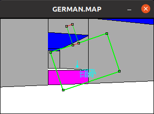
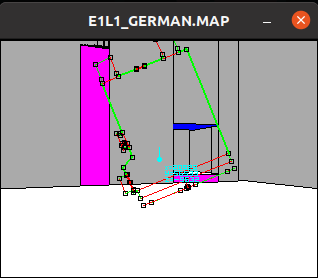
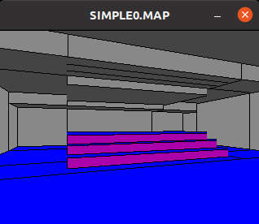

## `build-rs`

- PoC for a Build Engine MAP file renderer.
- Software renderer without graphics dependencies.

### Example

```
cargo run --release --example example -- map/tests/maps/GERMAN.MAP
```





### Limitations

- Maps with non-convex sectors break the renderer, meaning most maps from commercially-released games don't render properly... yet.
- Walking through walls also breaks the renderer (not really a limitation).