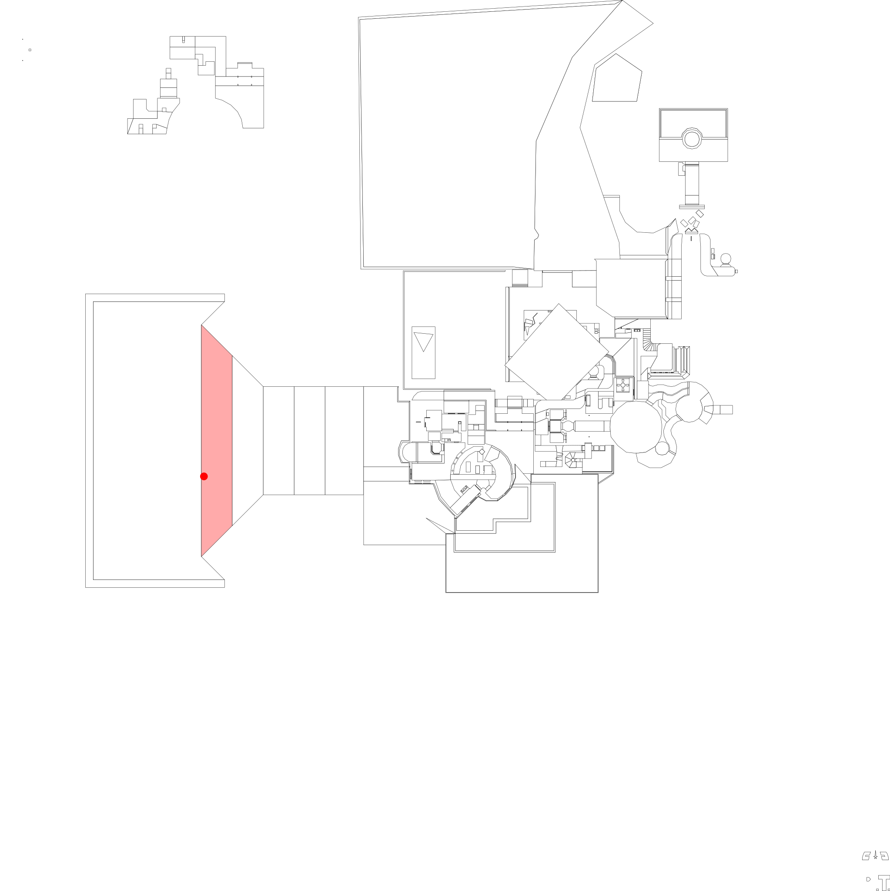

# `MAP` file parser

Utilities for parsing `MAP` files, which (along with `ART` files) were used by Build Engine games to hold the geometry and sprites of a game map.

## Supported features

* [x] sectors & walls
* [ ] sprites

## Example

```bash
# map_svg.rs generates an SVG image of the MAP geometry
cargo run --example VACA1.MAP vaca1.svg
```

