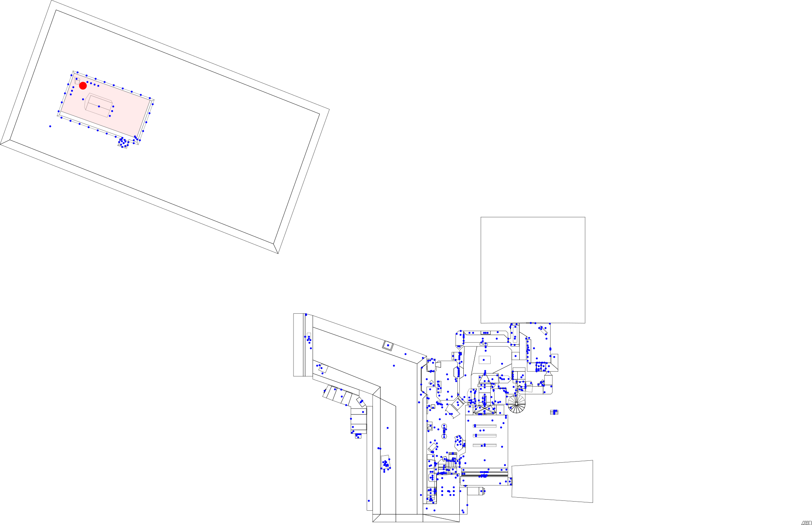

# `MAP` file parser

Utilities for parsing `MAP` files.

Files with a `*.MAP` extension hold the geometry and sprites of *Build Engine* game levels.

## Example

```bash
# map_svg.rs generates an SVG image of the MAP geometry
cargo run --example E1L1.MAP
```

